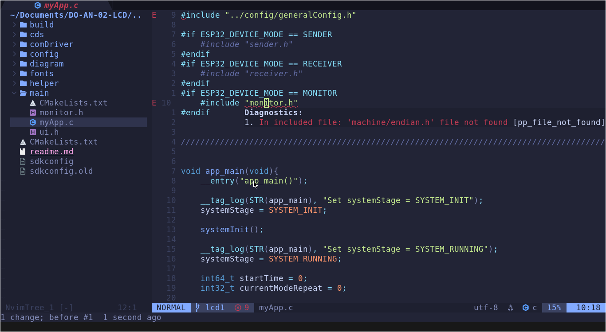

# NeoVim Configuration

## About

A clean, modular, and extensible NeoVim configuration built with Lazy.nvim. This setup provides a solid foundation for development with support for LSP, autocompletion, fuzzy finding, and more.



---

## Directory Structure

```bash
~/.config/nvim/
├── init.lua                    # Entry point, loads main module
├── lazy-lock.json              # Locked versions of all plugins
├── readme.md                   # This file
└── lua/ngxxfus/
    ├── init.lua                # Core bootstrap module
    ├── lazy_init.lua           # Lazy.nvim initialization
    ├── remap.lua               # Keybindings and remappings
    ├── set.lua                 # Editor settings and options
    └── lazy/                   # Plugin specifications
        ├── bufferline.lua      # Buffer tabs UI
        ├── cmp.lua             # Autocompletion (nvim-cmp)
        ├── colorizer.lua       # Color code highlighting
        ├── colorscheme.lua     # Color scheme management
        ├── comment.lua         # Comment toggling
        ├── icons.lua           # UI icons (nerdfont symbols)
        ├── lsp.lua             # Language Server Protocol setup
        ├── lualine.lua         # Status line
        ├── mason.lua           # LSP/tool installer
        ├── sessions.lua        # Session management
        ├── telescope.lua       # Fuzzy finder
        ├── treesitter.lua      # Syntax highlighting
        └── whichkey.lua        # Keybinding hints
```

---

## Installation

### Prerequisites

- **NeoVim** >= 0.9.0
- **Git** for plugin management
- **xclip** or **xsel** (Linux clipboard support)
- **Node.js** (optional, for some LSP servers)
- **Python3** (optional, for some tools)

### For Void Linux Users

Void Linux users should install the following packages:

```bash
sudo xbps-install -S neovim git xclip nodejs
```

If you need additional tools:

```bash
sudo xbps-install -S python3 ripgrep fd  # For better telescope search
```

### For Windows Users (WSL/Terminal Setup)

⚠️ **Note**: This configuration is optimized for Unix-like environments. For Windows:

- Use **WSL 2** (Windows Subsystem for Linux) or **Git Bash**
- Ensure clipboard tools are installed in your WSL distribution
- Terminal performance may vary; consider using **Windows Terminal** or **Alacritty**
- Some keybindings (like Alt+j/k) may need adjustment in Windows Terminal

### Setup Steps

1. **Clone or copy the configuration:**

   ```bash
   # If you have an existing config, back it up first
   mv ~/.config/nvim ~/.config/nvim.bak

   # Clone the configuration
   git clone https://github.com/ngxx-fus/neovim-conf.git ~/.config/nvim
   ```

2. **Start NeoVim:**

   ```bash
   nvim
   ```

   The first startup will automatically:
   - Download and install Lazy.nvim
   - Install all plugins specified in `lua/ngxxfus/lazy/`
   - Set up Mason for LSP server management

3. **Install LSP Servers (Optional):**

   Inside NeoVim, use Mason to install language servers:

   ```vim
   :Mason
   ```

   Or install specific servers:

   ```vim
   :MasonInstall lua rust_analyzer python-lsp-server
   ```

---

## Module Overview

### Core Modules

#### `init.lua` (Entry Point)
- Loads the main `ngxxfus` module
- Simple bootstrapping of all configuration

#### `lua/ngxxfus/init.lua` (Bootstrap)
- Sets the leader key to **Space**
- Orchestrates loading order:
  1. `set.lua` - Editor settings
  2. `remap.lua` - Keybindings
  3. `lazy_init.lua` - Plugin manager
  4. Plugin configurations from `lazy/`

#### `set.lua` (Editor Settings)
- Enable 24-bit RGB colors (`termguicolors`)
- Line numbers and relative numbering
- Tab and indentation settings (4 spaces)
- Clipboard synchronization with system clipboard

#### `remap.lua` (Keybindings)
Main keybindings include:

| Keybind | Action |
|---------|--------|
| `<A-j>` / `<A-k>` | Move line down/up |
| `<Space>h` / `<Space>l` | Previous/next buffer |
| `<Space>t` | Open terminal |
| `<Space>sr` | Restore session |
| `<Space>sl` | Load session |
| `<Tab>` / `<S-Tab>` | Indent/unindent |
| `<Space>f*` | Telescope finders |

See `remap.lua` for the complete list of keybindings.

### Plugin Modules

#### `icons.lua`
- Integrates nerdfont symbols for UI consistency
- Provides icons for various elements across plugins

#### `lsp.lua`
- **Mason** - Package manager for LSP servers, linters, formatters
- **Mason-LSPConfig** - Integration bridge between Mason and lspconfig
- **nvim-lspconfig** - Native LSP client configuration
- Provides goto definition, references, diagnostics, and more

#### `cmp.lua`
- **nvim-cmp** - Autocompletion engine
- **LuaSnip** - Snippet engine
- LSP, buffer, and snippet completion sources
- Smooth completion menu with previews

#### `telescope.lua`
- **Telescope** - Fuzzy finder for files, buffers, diagnostics
- **Telescope-fzf-native** - Native fzf backend for faster searching
- Integrated with Treesitter for better results

#### `lualine.lua`
- **Lualine** - Elegant status line
- Shows mode, file info, LSP status, git branch

#### `treesitter.lua`
- **Treesitter** - Advanced syntax highlighting
- Better understanding of code structure
- Enables incremental parsing for faster updates

#### `bufferline.lua`
- **Bufferline** - Buffer tabs at the top
- Visual management of open buffers

#### `colorscheme.lua`
- **Tokyonight** - Beautiful dark color scheme
- Easily swap for other schemes (e.g., Gruvbox, Dracula)

#### `comment.lua`
- **Comment.nvim** - Toggle comments with `gc` operator

#### `colorizer.lua`
- **Colorizer** - Preview color codes inline (#fff, rgb(), etc.)

#### `sessions.lua`
- **Persistence.nvim** - Auto-save and restore sessions
- Manual save/restore with keybindings

#### `whichkey.lua`
- **Which-key** - Display available keybindings on keypress
- Press `<Space>` to see all available commands

---

## Quick Start

After installation, you can:

1. **Fuzzy find files:** `<Space>ff`
2. **Search text:** `<Space>fw`
3. **Go to LSP definition:** `gd`
4. **Show diagnostics:** `<Space>e`
5. **Toggle comment:** `gc` (in visual/normal mode)
6. **Open terminal:** `<Space>t`

Press `<Space>` and wait to see all available keybindings via Which-key.

---

## Customization

### Change Color Scheme

Edit `lua/ngxxfus/set.lua`:

```lua
vim.cmd.colorscheme("tokyonight-storm")
-- Or try: "gruvbox", "dracula", "nord", etc.
```

### Add New Plugins

Create a new file in `lua/ngxxfus/lazy/` (e.g., `my_plugin.lua`):

```lua
return {
  "author/plugin-name",
  config = function()
    -- Your configuration here
  end,
}
```

### Modify Keybindings

Edit `lua/ngxxfus/remap.lua` and add your custom mappings:

```lua
vim.keymap.set("n", "<leader>x", ":SomeCommand<CR>", { desc = "Your command" })
```

---

## Important Notes for Specific Environments

### Void Linux

- **Package Manager:** `xbps-install` (Void's XBPS package manager)
- **Note:** Some packages may be named differently; check with `xbps-query -Rs <package>`
- **Clipboard:** Ensure `xclip` is installed for system clipboard support
- **LSP Servers:** You may need to compile some servers; Mason will handle this automatically

### UIWindow / WSL2

- **Terminal Emulator:** Use **Windows Terminal**, **Alacritty**, or **Hyper** for better experience
- **Clipboard:** May require additional setup; test with `:call system('xclip -selection clipboard', @a)`
- **Performance:** Avoid running resource-heavy LSP servers; stick to lightweight alternatives
- **Color Support:** Ensure terminal supports true color (24-bit); set `$TERM=xterm-256color` or higher

### macOS

- Install via Homebrew: `brew install neovim git`
- Clipboard works natively (no xclip needed)
- Some LSP servers compile faster on macOS

---

## Troubleshooting

### Plugins not loading

1. Delete the Lazy cache: `rm -rf ~/.local/share/nvim/lazy/`
2. Restart NeoVim: `:Lazy sync`
3. Check for errors: `:Lazy log`

### Clipboard not working

- **Linux:** Install `xclip` or `xsel`: `sudo apt install xclip` (Ubuntu/Debian) or `sudo xbps-install -S xclip` (Void)
- **WSL:** Install clipboard tool in WSL or use `wsl-copy`/`wsl-paste`
- **Test:** `:call system('echo test | xclip -selection clipboard')`

### LSP not starting

1. Open `:Mason` and install language servers
2. Restart NeoVim
3. Check diagnostics: `:LspLog`

### Terminal keybindings not working

- Some terminals don't support Alt+key sequences
- Try using different keybindings in `remap.lua`
- For WSL, enable "Send function keys" in Windows Terminal settings

---

## License

Feel free to use and modify this configuration. Enjoy your NeoVim experience!

---

## References

- [NeoVim Documentation](https://neovim.io/doc/user/)
- [Lazy.nvim](https://github.com/folke/lazy.nvim)
- [Mason.nvim](https://github.com/williamboman/mason.nvim)
- [Telescope](https://github.com/nvim-telescope/telescope.nvim)
- [Treesitter](https://github.com/nvim-treesitter/nvim-treesitter)
